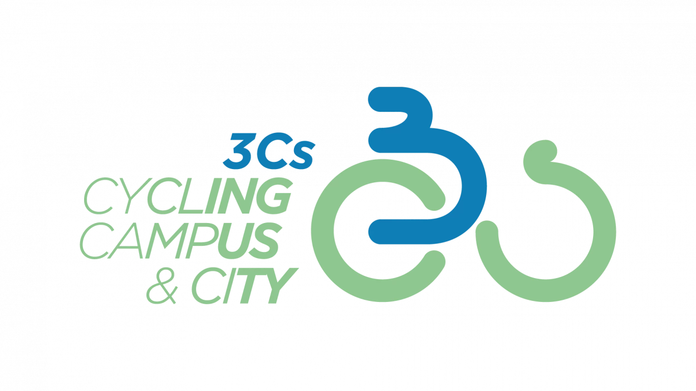

```{r setup, include=FALSE}
knitr::opts_chunk$set(echo = TRUE,
                      include = FALSE,
                      warning = FALSE,
                      message = FALSE)
options(knitr.kable.NA = '')
```

```{r packages, message=FALSE, warning=FALSE, include=FALSE}
library(dplyr)
library(sf)
library(leaflet)
library(tmap)
tmap_mode("view")

```

```{r map3c function}
map3C = function(Bike, Train, Title) {
  if (nrow(Train) == 0) {
    tm_shape(Bike) +
      tm_lines(
        lwd = 5,
        col = "Stage",
        id = "End",
        popup.vars = c(
          "Stage",
          "Start",
          "End",
          "Distance",
          "Gain",
          "Duration",
          "EuroVelo",
          # "Mode",
          # "Travel",
          "Acomodation",
          "Notes"
        )
      ) +
      tm_text("Distance") +
      tm_title(Title) +
      tm_basemap(providers$Esri.WorldGrayCanvas) +
      tm_basemap(providers$OpenStreetMap) +
      tm_basemap(providers$CyclOSM) +
      tm_basemap(providers$OpenTopoMap) +
      tm_basemap(providers$Esri.WorldImagery)
    
  } else {
    tm_shape(Bike) +
      tm_lines(
        lwd = 4,
        col = "Stage",
        id = "End",
        popup.vars = c(
          "Stage",
          "Start",
          "End",
          "Distance",
          "Gain",
          "Duration",
          "EuroVelo",
          # "Mode",
          # "Travel",
          "Acomodation",
          "Notes"
        )
      ) +
      tm_text("Distance") +
      tm_shape(Train) +
      tm_lines(
        lwd = 2,
        lty = "dashed",
        col = "grey20",
        id = "End",
        popup.vars = c(
          "Stage",
          "Start",
          "End",
          "Distance",
          "Mode",
          "Travel",
          "Acomodation",
          "Notes"
        )
      ) +
      tm_text("Distance") +
      tm_title(Title) +
      tm_basemap(providers$Esri.WorldGrayCanvas) +
      tm_basemap(providers$OpenStreetMap) +
      tm_basemap(providers$CyclOSM) +
      tm_basemap(providers$OpenTopoMap) +
      tm_basemap(providers$Esri.WorldImagery)
    # options = layersControlOptions(collapsed = FALSE) #not working
    
  }
}

Food = 40
```

## 3C Project

The **3Cs - Cycling, Campus & City** Program will facilitate travel between Cities and Campuses through more sustainable means of transport and promoting the health and well-being of the universities community.

{align="centre" width="300"}

The central scope of this working group under the Erasmus + programme is to promote sustainability through sport and ecological mobility and identify, promote, improve, and enhance an active and green mobility. Bicycle, whether electric or conventional, will be used as the main means of transport, and cycle paths will be identified and promoted, primarily to, from and within the university campus and the city. Other forms of healthy and active mobility will also be explored in this project such as walking. Overall, it aims to identify good practices, collect data from the pilot group of participants by using a tool produced by the project and through two studies (habits and behaviours and best routes), collect practical and educational content, promote sustainable travel habits, change behaviours for greater local and European impact and raise awareness of the importance of contributing to a greener world through sport and use of sustainable means of transport.

The “3Cs - Cycling, Campus & City” project is funded by the European Union.

### A sustainable route connecting the 4 Campi

This route (in test mode) will connect the 4 campi of the Project's partners:

-   Universidade de Coimbra
-   Universidad Camilo Jose Cel, Centro de Ensenanza Universitaria Sek Saucjc (Madrid)
-   Universite Paul-Valery Montpellier 3
-   Universita Degli Studi di Torino

#### Criteria used for planning the routes

-   Only sustainable transportation is used, such as walking, cycling, train, and ferry.

-   Destination spots with available amenities, including food, camping, and accommodation.

-   Route profile for easy ride (not superman/woman).

-   Stages from 35 to 100 km long.

-   Avoid gravel and busy roads as much as possible.

## Madrid - Coimbra {.tabset .tabset-pills}

This connection is a challenge. The train line which offers the best connection in Portugal is suspended for improvements until 2026.

```{r madcoi}
MADCOI = st_read("route/MAD-COI.gpkg", fid_column_name = "fid", quiet = TRUE)
```

### Option 1 {.active}

```{r map11, echo=FALSE, include=TRUE}
MADCOI1 = MADCOI |>
  filter(fid %in% c(16,20:25)) |>
  # mutate(lty = ifelse(Mode == "Train", "dashed", "solid"))
  mutate(Stage = as.character(c(0:6)))

Bike = MADCOI1 |> filter(Mode == "Bike")
Train = MADCOI1 |> filter(Mode != "Bike")
Title = "MAD-COI, option 1"

map3C(Train = Train, Bike = Bike, Title = Title)

Days = 7
```

```{r table11, echo=FALSE, include=TRUE}
knitr::kable(
  MADCOI1 |> 
    filter(Mode == "Bike") |> 
    st_drop_geometry() |> 
    mutate(Stage = as.integer(Stage)) |>
    arrange(Stage) |> 
    select(
    Stage,
    Start,
    End,
    Distance,
    Gain,
    Duration,
    # EuroVelo,
    # Acomodation,
    Notes
  )  |> arrange(Stage),
  caption = "Option 1 bike stages"
) |> 
  # NA as empty cell
  kableExtra::kable_styling(bootstrap_options = "striped", full_width = F, position = "center")
```

#### Statistics

-   Total Bike Distance: `r sum(MADCOI1$Distance[MADCOI1$Mode == "Bike"], na.rm=T)` km
-   Total Up Gain: `r sum(MADCOI1$Gain, na.rm=T)` m
-   Total Days: `r Days`
-   Days on Bike: `r table(MADCOI1$Mode)[[1]]`
-   Accommodation cost: `r sum(MADCOI1$Acomodation, na.rm=T)-55` €
-   Train cost: `r sum(MADCOI1$Travel[MADCOI1$Mode == "Train"], na.rm=T)` €
-   Food cost: `r Days*Food` €
-   Total cost per person: `r sum(MADCOI1$Acomodation, na.rm=T)-55 + sum(MADCOI1$Travel[MADCOI1$Mode == "Train"], na.rm=T) + Days*Food` €
-   [Extra] Air and Train cost (from Lisbon to Start and from End to Lisbon): `r 70+20` €

#### Pros and Cons

-   Train to Salamanca jumps arid region
-   Less days, with balanced distances
-   Not very hard stages
-   Uses some secondary state roads

### Option 2

```{r map12, echo=FALSE, include=TRUE}
MADCOI2 = MADCOI |>
  filter(fid %in% c(17:19,20:25)) |>
  # mutate(lty = ifelse(Mode == "Train", "dashed", "solid"))
  mutate(Stage = as.character(c(0:8)))

Bike = MADCOI2 |> filter(Mode == "Bike")
Train = MADCOI2 |> filter(Mode != "Bike")
Title = "MAD-COI, option 2"

map3C(Train = Train, Bike = Bike, Title = Title)

Days = 9
```

```{r table12, echo=FALSE, include=TRUE}
knitr::kable(
  MADCOI2 |> 
    filter(Mode == "Bike") |> 
    st_drop_geometry() |> 
    mutate(Stage = as.integer(Stage)) |>
    arrange(Stage) |> 
    select(
    Stage,
    Start,
    End,
    Distance,
    Gain,
    Duration,
    # EuroVelo,
    # Acomodation,
    Notes
  )  |> arrange(Stage),
  caption = "Option 2 bike stages"
) |> 
  # NA as empty cell
  kableExtra::kable_styling(bootstrap_options = "striped", full_width = F, position = "center")
```

#### Statistics

-   Total Bike Distance: `r sum(MADCOI2$Distance[MADCOI2$Mode == "Bike"], na.rm=T)` km
-   Total Up Gain: `r sum(MADCOI2$Gain, na.rm=T)` m
-   Total Days: `r Days`
-   Days on Bike: `r table(MADCOI2$Mode)[[1]]`
-   Accommodation cost: `r sum(MADCOI2$Acomodation, na.rm=T)` €
-   Train cost: `r sum(MADCOI2$Travel[MADCOI2$Mode == "Train"], na.rm=T)` €
-   Food cost: `r Days*Food` €
-   Total cost per person: `r sum(MADCOI2$Acomodation, na.rm=T) + sum(MADCOI2$Travel[MADCOI2$Mode == "Train"], na.rm=T) + Days*Food` €
-   [Extra] Air and Train cost (from Lisbon to Start and from End to Lisbon): `r 70+20` €

#### Pros and Cons

-   More days
-   Not very hard stages
-   Uses some secondary state roads

## Madrid - Montpellier {.tabset .tabset-pills}

For all the options, we opt to take the high-speed train from Madrid to Barcelona and start biking from there.

```{r madmon}
MADMON = st_read("route/MAD-MON.gpkg", fid_column_name = "fid", quiet = TRUE)
```

```{r export geojson, eval=FALSE}
# export to geojson
for (i in MADMON$fid) {
  route = MADMON |> filter(fid == i) |> st_zm(drop = TRUE, what = "ZM") |> select(geometry)
  st_write(route, paste0("route/GeoJSON/MAD-MON_", i, ".gpx"), quiet = TRUE, delete_dsn = TRUE)
}
# I thought it would be useful for elevation profile but does not work with ORS
```

### Option 1 {.active}

```{r map21, echo=FALSE, include=TRUE}
MADMON1 = MADMON |>
  filter(fid %in% c(2, 3, 5, 6, 7, 13, 14, 15)) |>
  # mutate(lty = ifelse(Mode == "Train", "dashed", "solid"))
  mutate(Stage = as.character(c(0:7)))

Bike = MADMON1 |> filter(Mode == "Bike")
Train = MADMON1 |> filter(Mode != "Bike")
Title = "MAD-MON, option 1"

map3C(Train = Train, Bike = Bike, Title = Title)

Days = 8
```

```{r table21, echo=FALSE, include=TRUE}
knitr::kable(
  MADMON1 |> 
    filter(Mode == "Bike") |> 
    st_drop_geometry() |> 
    mutate(Stage = as.integer(Stage)) |>
    arrange(Stage) |> 
    select(
    Stage,
    Start,
    End,
    Distance,
    Gain,
    Duration,
    EuroVelo,
    # Acomodation,
    Notes
  )  |> arrange(Stage),
  caption = "Option 1 bike stages"
) |> 
  # NA as empty cell
  kableExtra::kable_styling(bootstrap_options = "striped", full_width = F, position = "center")
```

#### Statistics

-   Total Bike Distance: `r sum(MADMON1$Distance[MADMON1$Mode == "Bike"], na.rm=T)` km
-   Total Up Gain: `r sum(MADMON1$Gain, na.rm=T)` m
-   Total Days: `r Days`
-   Days on Bike: `r table(MADMON1$Mode)[[1]]`
-   Accommodation cost: `r sum(MADMON1$Acomodation, na.rm=T)` €
-   Train cost: `r sum(MADMON1$Travel[MADMON1$Mode == "Train"], na.rm=T)` €
-   Food cost: `r Days*Food` €
-   Total cost per person: `r sum(MADMON1$Acomodation, na.rm=T) + sum(MADMON1$Travel[MADMON1$Mode == "Train"], na.rm=T) + Days*Food` €
-   [Extra] Air cost (from Lisbon to Start and from End to Lisbon): `r 70+150` €

#### Pros and Cons

-   1 day longer
-   shorter stages
-   has some compact gravel roads

<!-- https://www.mapchannels.com/routemaps3/map.htm?title=teste%20rota%201 -->

### Option 2

```{r map22, echo=FALSE, include=TRUE}

MADMON2 = MADMON |> 
   filter(fid %in% c(2,8,12,7,13,14,15)) |> 
   mutate(Stage = as.character(c(0,3,1,2,4,5,6))) |> 
   arrange("Stage")

Bike = MADMON2 |> filter(Mode == "Bike")
Train = MADMON2 |> filter(Mode != "Bike")
Title = "MAD-MON, option 2"

map3C(Train = Train, Bike = Bike, Title = Title)

Days = 7

```

```{r table22, echo=FALSE, include=TRUE}
knitr::kable(
  MADMON2 |> 
    filter(Mode == "Bike") |> 
    st_drop_geometry() |> 
    mutate(Stage = as.integer(Stage)) |>
    arrange(Stage) |> 
    select(
    Stage,
    Start,
    End,
    Distance,
    Gain,
    Duration,
    EuroVelo,
    # Acomodation,
    Notes
  )  |> arrange(Stage),
  caption = "Option 2 bike stages"
) |> 
  # NA as empty cell
  kableExtra::kable_styling(bootstrap_options = "striped", full_width = F, position = "center")
```

#### Statistics

-   Total Bike Distance: `r sum(MADMON2$Distance[MADMON2$Mode == "Bike"], na.rm=T)` km
-   Total Up Gain: `r sum(MADMON2$Gain, na.rm=T)` m
-   Total Days: `r Days`
-   Days on Bike: `r table(MADMON2$Mode)[[1]]`
-   Accommodation cost: `r sum(MADMON2$Acomodation, na.rm=T)` €
-   Train cost: `r sum(MADMON2$Travel[MADMON2$Mode == "Train"], na.rm=T)` €
-   Food cost: `r Days*Food` €
-   Total cost per person: `r sum(MADMON2$Acomodation, na.rm=T) + sum(MADMON2$Travel[MADMON2$Mode == "Train"], na.rm=T) + Days*Food` €
-   [Extra] Air cost (from Lisbon to Start and from End to Lisbon): `r 70+150` €

#### Pros and Cons

-   1 day shorter
-   1 long stage (100 km) in busy roads uphill
-   has some compact gravel roads

## Montpellier - Turin {.tabset .tabset-pills}

```{r montur}
MONTUR = st_read("route/MON-TUR.gpkg", fid_column_name = "fid", quiet = TRUE)
```

### Option 1

```{r map31, echo=FALSE, include=TRUE}
MONTUR1 = MONTUR |>
  filter(fid %in% c(16,22,24,35,34,37,38)) |>
  # mutate(lty = ifelse(Mode == "Train", "dashed", "solid"))
  mutate(Stage = as.character(c(1:7)))

Bike = MONTUR1 |> filter(Mode == "Bike")
Train = MONTUR1 |> filter(Mode != "Bike")
Title = "MON-TUR, option 1"

map3C(Train = Train, Bike = Bike, Title = Title)

Days = 9
```

```{r table31, echo=FALSE, include=TRUE}
knitr::kable(
  MONTUR1 |> 
    filter(Mode == "Bike") |> 
    st_drop_geometry() |> 
    mutate(Stage = as.integer(Stage)) |>
    arrange(Stage) |> 
    select(
    Stage,
    Start,
    End,
    Distance,
    Gain,
    Duration,
    EuroVelo,
    # Acomodation,
    Notes
  )  |> arrange(Stage),
  caption = "Option 1 bike stages"
) |> 
  # NA as empty cell
  kableExtra::kable_styling(bootstrap_options = "striped", full_width = F, position = "center")
```

#### Statistics

-   Total Bike Distance: `r sum(MONTUR1$Distance[MONTUR1$Mode == "Bike"], na.rm=T)` km
-   Total Up Gain: `r sum(MONTUR1$Gain, na.rm=T)` m
-   Total Days: `r Days`
-   Days on Bike: `r table(MONTUR1$Mode)[[1]]`
-   Accommodation cost: `r sum(MONTUR1$Acomodation, na.rm=T)+60` €
-   Train cost: `r sum(MONTUR1$Travel[MONTUR1$Mode == "Train"], na.rm=T)` €
-   Food cost: `r Days*Food` €
-   Total cost per person: `r sum(MONTUR1$Acomodation, na.rm=T)+60 + sum(MONTUR1$Travel[MONTUR1$Mode == "Train"], na.rm=T) + Days*Food` €
-   [Extra] Air cost (from Lisbon to Start and from End to Lisbon): `r 150+130` €

#### Pros and Cons

-   2 days on train (6h + 3h30)
-   1 longer stage 79km with constant 1% uphill
-   cheaper

### Option 2

```{r map32, echo=FALSE, include=TRUE}
MONTUR2 = MONTUR |>
  filter(fid %in% c(16,22,23,26,35,34,37,38)) |>
  # mutate(lty = ifelse(Mode == "Train", "dashed", "solid"))
  mutate(Stage = as.character(c(1:8)))

Bike = MONTUR2 |> filter(Mode == "Bike")
Train = MONTUR2 |> filter(Mode != "Bike")
Title = "MON-TUR, option 2"

map3C(Train = Train, Bike = Bike, Title = Title)

Days = 10
```

```{r table32, echo=FALSE, include=TRUE}
knitr::kable(
  MONTUR2 |> 
    filter(Mode == "Bike") |> 
    st_drop_geometry() |> 
    mutate(Stage = as.integer(Stage)) |>
    arrange(Stage) |> 
    select(
    Stage,
    Start,
    End,
    Distance,
    Gain,
    Duration,
    EuroVelo,
    # Acomodation,
    Notes
  )  |> arrange(Stage),
  caption = "Option 2 bike stages"
) |> 
  # NA as empty cell
  kableExtra::kable_styling(bootstrap_options = "striped", full_width = F, position = "center")
```

#### Statistics

-   Total Bike Distance: `r sum(MONTUR2$Distance[MONTUR2$Mode == "Bike"], na.rm=T)` km
-   Total Up Gain: `r sum(MONTUR2$Gain, na.rm=T)` m
-   Total Days: `r Days`
-   Days on Bike: `r table(MONTUR2$Mode)[[1]]`
-   Accommodation cost: `r sum(MONTUR2$Acomodation, na.rm=T)+60` €
-   Train cost: `r sum(MONTUR2$Travel[MONTUR2$Mode == "Train"], na.rm=T)` €
-   Food cost: `r Days*Food` €
-   Total cost per person: `r sum(MONTUR2$Acomodation, na.rm=T)+60 + sum(MONTUR2$Travel[MONTUR2$Mode == "Train"], na.rm=T) + Days*Food` €
-   [Extra] Air cost (from Lisbon to Start and from End to Lisbon): `r 150+130` €

#### Pros and Cons

-   2 days on train (6h + 3h30)
-   2 shorter stages

### Option 3

```{r map33, echo=FALSE, include=TRUE}
MONTUR3 = MONTUR |>
  filter(fid %in% c(16,22,24,27,36,29,30,34,37,38)) |>
  # mutate(lty = ifelse(Mode == "Train", "dashed", "solid"))
  mutate(Stage = as.character(c(1:10)))

Bike = MONTUR3 |> filter(Mode == "Bike")
Train = MONTUR3 |> filter(Mode != "Bike")
Title = "MON-TUR, option 3"

map3C(Train = Train, Bike = Bike, Title = Title)

Days = 10
```

```{r table33, echo=FALSE, include=TRUE}
knitr::kable(
  MONTUR3 |> 
    filter(Mode == "Bike") |> 
    st_drop_geometry() |> 
    mutate(Stage = as.integer(Stage)) |>
    arrange(Stage) |> 
    select(
    Stage,
    Start,
    End,
    Distance,
    Gain,
    Duration,
    EuroVelo,
    # Acomodation,
    Notes
  )  |> arrange(Stage),
  caption = "Option 3 bike stages"
) |> 
  # NA as empty cell
  kableExtra::kable_styling(bootstrap_options = "striped", full_width = F, position = "center")
```

#### Statistics

-   Total Bike Distance: `r sum(MONTUR3$Distance[MONTUR3$Mode == "Bike"], na.rm=T)` km
-   Total Up Gain: `r sum(MONTUR3$Gain, na.rm=T)` m
-   Total Days: `r Days`
-   Days on Bike: `r table(MONTUR3$Mode)[[1]]`
-   Accommodation cost: `r sum(MONTUR3$Acomodation, na.rm=T)-65` €
-   Train cost: `r sum(MONTUR3$Travel[MONTUR3$Mode == "Train"], na.rm=T)` €
-   Food cost: `r Days*Food` €
-   Total cost per person: `r sum(MONTUR3$Acomodation, na.rm=T)-65 + sum(MONTUR3$Travel[MONTUR3$Mode == "Train"], na.rm=T) + Days*Food` €
-   [Extra] Air cost (from Lisbon to Start and from End to Lisbon): `r 150+130` €

#### Pros and Cons

-   1 longer stage 99 km, with 1800m gain
-   still less days, but more on bike
-   Scenic route
-   **Second best option**

### Option 4

```{r map34, echo=FALSE, include=TRUE}
MONTUR4 = MONTUR |>
  filter(fid %in% c(16,22,23,26,27,36,29,30,34,37,38)) |>
  # mutate(lty = ifelse(Mode == "Train", "dashed", "solid"))
  mutate(Stage = as.character(c(1:11)))

Bike = MONTUR4 |> filter(Mode == "Bike")
Train = MONTUR4 |> filter(Mode != "Bike")
Title = "MON-TUR, option 4"

map3C(Train = Train, Bike = Bike, Title = Title)

Days = 11
```

```{r table34, echo=FALSE, include=TRUE}
knitr::kable(
  MONTUR4 |> 
    filter(Mode == "Bike") |> 
    st_drop_geometry() |> 
    mutate(Stage = as.integer(Stage)) |>
    arrange(Stage) |> 
    select(
    Stage,
    Start,
    End,
    Distance,
    Gain,
    Duration,
    EuroVelo,
    # Acomodation,
    Notes
  )  |> arrange(Stage),
  caption = "Option 4 bike stages"
) |> 
  # NA as empty cell
  kableExtra::kable_styling(bootstrap_options = "striped", full_width = F, position = "center")
```

#### Statistics

-   Total Bike Distance: `r sum(MONTUR4$Distance[MONTUR4$Mode == "Bike"], na.rm=T)` km
-   Total Up Gain: `r sum(MONTUR4$Gain, na.rm=T)` m
-   Total Days: `r Days`
-   Days on Bike: `r table(MONTUR4$Mode)[[1]]`
-   Accommodation cost: `r sum(MONTUR4$Acomodation, na.rm=T)-65` €
-   Train cost: `r sum(MONTUR4$Travel[MONTUR4$Mode == "Train"], na.rm=T)` €
-   Food cost: `r Days*Food` €
-   Total cost per person: `r sum(MONTUR4$Acomodation, na.rm=T)-65 + sum(MONTUR4$Travel[MONTUR4$Mode == "Train"], na.rm=T) + Days*Food` €
-   [Extra] Air cost (from Lisbon to Start and from End to Lisbon): `r 150+130` €

#### Pros and Cons

-   1 longer stage 99 km, with 1800m gain
-   more days
-   Scenic route

### Option 5 {.active}

```{r map35, echo=FALSE, include=TRUE}
MONTUR5 = MONTUR |>
  filter(fid %in% c(16,22,24,27,31,32,33,34,37,38)) |>
  # mutate(lty = ifelse(Mode == "Train", "dashed", "solid"))
  mutate(Stage = as.character(c(1:10)))

Bike = MONTUR5 |> filter(Mode == "Bike")
Train = MONTUR5 |> filter(Mode != "Bike")
Title = "MON-TUR, option 5"

map3C(Train = Train, Bike = Bike, Title = Title)

Days = 11
```

```{r table35, echo=FALSE, include=TRUE}
knitr::kable(
  MONTUR5 |> 
    filter(Mode == "Bike") |> 
    st_drop_geometry() |> 
    mutate(Stage = as.integer(Stage)) |>
    arrange(Stage) |> 
    select(
    Stage,
    Start,
    End,
    Distance,
    Gain,
    Duration,
    EuroVelo,
    # Acomodation,
    Notes
  )  |> arrange(Stage),
  caption = "Option 5 bike stages"
) |> 
  # NA as empty cell
  kableExtra::kable_styling(bootstrap_options = "striped", full_width = F, position = "center")
```

#### Statistics

-   Total Bike Distance: `r sum(MONTUR5$Distance[MONTUR5$Mode == "Bike"], na.rm=T)` km
-   Total Up Gain: `r sum(MONTUR5$Gain, na.rm=T)` m
-   Total Days: `r Days`
-   Days on Bike: `r table(MONTUR5$Mode)[[1]]`
-   Accommodation cost: `r sum(MONTUR5$Acomodation, na.rm=T)-11` €
-   Train cost: `r sum(MONTUR5$Travel[MONTUR5$Mode == "Train"], na.rm=T)` €
-   Food cost: `r Days*Food` €
-   Total cost per person: `r sum(MONTUR5$Acomodation, na.rm=T)-11 + sum(MONTUR5$Travel[MONTUR5$Mode == "Train"], na.rm=T) + Days*Food` €
-   [Extra] Air cost (from Lisbon to Start and from End to Lisbon): `r 150+130` €

#### Pros and Cons

-   less days, and not very long routes
-   1 rest day in Limone Piemonte (Train)
-   Scenic route

### Option 6

```{r map36, echo=FALSE, include=TRUE}
MONTUR6 = MONTUR |>
  filter(fid %in% c(16,22,23,26,27,31,32,33,34,37,38)) |>
  # mutate(lty = ifelse(Mode == "Train", "dashed", "solid"))
  mutate(Stage = as.character(c(1:11)))

Bike = MONTUR6 |> filter(Mode == "Bike")
Train = MONTUR6 |> filter(Mode != "Bike")
Title = "MON-TUR, option 6"

map3C(Train = Train, Bike = Bike, Title = Title)

Days = 12
```

```{r table36, echo=FALSE, include=TRUE}
knitr::kable(
  MONTUR6 |> 
    filter(Mode == "Bike") |> 
    st_drop_geometry() |> 
    mutate(Stage = as.integer(Stage)) |>
    arrange(Stage) |> 
    select(
    Stage,
    Start,
    End,
    Distance,
    Gain,
    Duration,
    EuroVelo,
    # Acomodation,
    Notes
  )  |> arrange(Stage),
  caption = "Option 6 bike stages"
) |> 
  # NA as empty cell
  kableExtra::kable_styling(bootstrap_options = "striped", full_width = F, position = "center")
```

#### Statistics

-   Total Bike Distance: `r sum(MONTUR6$Distance[MONTUR6$Mode == "Bike"], na.rm=T)` km
-   Total Up Gain: `r sum(MONTUR6$Gain, na.rm=T)` m
-   Total Days: `r Days`
-   Days on Bike: `r table(MONTUR6$Mode)[[1]]`
-   Accommodation cost: `r sum(MONTUR6$Acomodation, na.rm=T)-21` €
-   Train cost: `r sum(MONTUR6$Travel[MONTUR6$Mode == "Train"], na.rm=T)` €
-   Food cost: `r Days*Food` €
-   Total cost per person: `r sum(MONTUR6$Acomodation, na.rm=T)-21 + sum(MONTUR6$Travel[MONTUR6$Mode == "Train"], na.rm=T) + Days*Food` €
-   [Extra] Air cost (from Lisbon to Start and from End to Lisbon): `r 150+130` €

#### Pros and Cons

-   more days, and not very long routes
-   1 rest day in Limone Piemonte (Train)
-   Scenic route
-   the most expensive option
